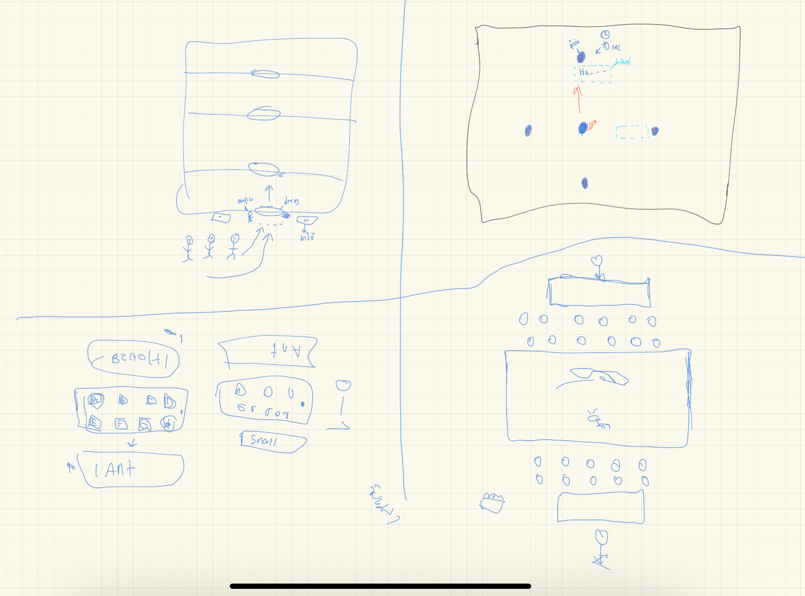

# รายงานสัปดาห์ที่ 2

## สมาชิก
- จักรกฤษณ์ บางต่าย (ไม่มา)
- ณภัทร รัศมี (ประธาน)
- ธนกฤต พรรณเผือก (เลขา)

---

## ปัญหาที่พบ
1. ปัญหาด้านคำศัพท์ภาษาอังกฤษ
2. ปัญหาด้าน Grammar

---

## สรุปแนวทาง
จะทำเกมที่เกี่ยวกับ Vocabulary เพราะเห็นว่าคำศัพท์ภาษาอังกฤษสำคัญมากในการเริ่มต้นเรียน เนื่องจากเป็นพื้นฐานที่จะต่อยอดไปยัง Grammar, Listening, Writing, Speaking ได้
ทำเกมแบบเกมกระดาน บอดเกม

ทำเกมแนว2D แบบต่อสู้ มีเนื้อเรื่อง สู้แบบ Turn-Based มีบอสให้ตี มีดันเจียน คล้ายpokemonยุคก่อน และต้องเอาศัทพ์ภาษาอังกฤษเข้าไปผสมผสาน โปรแกรม rpg maker
